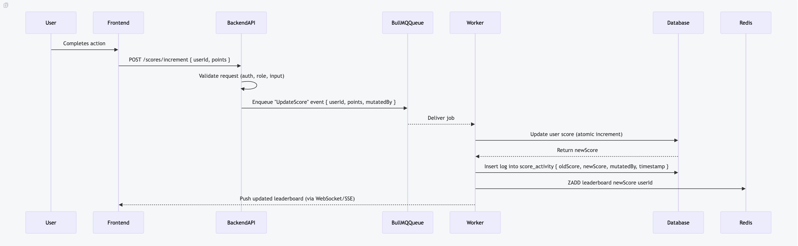

# Problem 6: Architecture – Scoreboard Module

This document specifies a **Scoreboard API module** that manages user scores, provides a real-time leaderboard, and ensures secure score mutations with audit logging and event-driven processing.  
The specification is intended for backend engineers to implement.

---

## Objectives
- Provide a **leaderboard (top 10 users)** updated in real time.
- Allow **secure score updates** by users and admins.
- Log **every score mutation** in a dedicated table for auditing.
- Use **Redis** for efficient leaderboard queries.
- Decouple score updates with **BullMQ** for resiliency and scalability.

---

## Module Responsibilities
1. **Receive API calls** for score updates:
   - Users can only increment **their own score**.
   - Admins (manually approved) can adjust any score (increase/decrease).
   - All changes are pushed into a **BullMQ queue**.

2. **Process updates via BullMQ worker**:
   - Validate the job payload.
   - Fetch old score from DB.
   - Apply mutation (atomic update).
   - Write entry to `score_activity`.
   - Sync leaderboard in Redis.

3. **Log every mutation** in `score_activity` table:
   - `id` (auto-increment)
   - `userId`
   - `oldScore`
   - `newScore`
   - `mutatedBy` (userId if self, or adminId if admin updated)
   - `timestamp`

4. **Expose APIs**:
   - `POST /api/scores/increment` (user-only)
   - `POST /api/scores/adjust` (admin-only)
   - `GET /api/scores/top` (leaderboard)

5. **Broadcast updates** to subscribed clients via WebSockets.

---

## Flow of Execution (with BullMQ)

```
sequenceDiagram
    participant User
    participant Frontend
    participant BackendAPI
    participant BullMQQueue
    participant Worker
    participant Database
    participant Redis

    User->>Frontend: Completes action
    Frontend->>BackendAPI: POST /scores/increment { userId, points }
    BackendAPI->>BackendAPI: Validate request (auth, role, input)
    BackendAPI->>BullMQQueue: Enqueue "UpdateScore" event { userId, points, mutatedBy }
    BullMQQueue-->>Worker: Deliver job
    Worker->>Database: Update user score (atomic increment)
    Database-->>Worker: Return newScore
    Worker->>Database: Insert log into score_activity { oldScore, newScore, mutatedBy, timestamp }
    Worker->>Redis: ZADD leaderboard newScore userId
    Worker-->>Frontend: Push updated leaderboard (via WebSocket/SSE)
````



---

##  API Endpoints

### 1. Increment Score (User Only)

* **POST** `/api/scores/increment`
* **Auth**: User token
* **Body**:

```json
{ "userId": "user123", "points": 10 }
```

* **Response**:

```json
{ "userId": "user123", "newScore": 150 }
```

### 2. Adjust Score (Admin Only)

* **POST** `/api/scores/adjust`
* **Auth**: Admin token (must be manually approved)
* **Body**:

```json
{ "targetUserId": "user123", "newScore": 200 }
```

* **Response**:

```json
{ "userId": "user123", "oldScore": 150, "newScore": 200 }
```

### 3. Get Leaderboard

* **GET** `/api/scores/top`
* **Response**:

```json
[
  { "userId": "userA", "score": 250 },
  { "userId": "userB", "score": 240 }
]
```

---

## Database Schema (Postgres/Prisma)

```prisma
model User {
  id         String           @id
  name       String
  score      Int              @default(0)
  isAdmin    Boolean          @default(false)
  activities ScoreActivity[]
}

model ScoreActivity {
  id         Int      @id @default(autoincrement())
  userId     String
  oldScore   Int
  newScore   Int
  mutatedBy  String   // who performed the change (self or admin)
  createdAt  DateTime @default(now())
}
```

---

## Leaderboard with Redis

* Use **Sorted Set (ZSET)**:

    * Key: `"leaderboard"`
    * Member: `userId`
    * Score: `user.score`

### Commands

* **Update score**:

  ```bash
  ZADD leaderboard <newScore> <userId>
  ```
* **Get top 10 users**:

  ```bash
  ZREVRANGE leaderboard 0 9 WITHSCORES
  ```
* **Remove user (if needed)**:

  ```bash
  ZREM leaderboard <userId>
  ```

---

##  BullMQ Integration

* **Queue Name**: `score-updates`

### Producer (API Layer)

```ts
await scoreQueue.add("UpdateScore", { userId, points, mutatedBy });
```

### Consumer (Worker)

```ts
scoreQueue.process("UpdateScore", async (job) => {
    const { userId, points, mutatedBy } = job.data;

    // 1. Fetch old score
    //    - Read the current score from the users table.
    //    - This is needed so we can log the old value into score_activity for auditing.
    //    - If the user doesn’t exist, fail the job (invalid request).

    // 2. Update DB atomically
    //    - Use Postgres’ "UPDATE users SET score = score + X" which is safe because of MVCC.
    //    - Postgres guarantees atomic increments at the row level (no explicit locks required).
    //    - Even under heavy concurrency, each update is serialized correctly by Postgres.

    // 3. Log into score_activity
    //    - Insert a record that includes: userId, oldScore, newScore, mutatedBy, and timestamp.
    //    - This ensures every change (by user or admin) is auditable and traceable.
    //    - Helps detect malicious actions or admin abuse later.

    // 4. Update Redis leaderboard
    //    - Push the new score into a Redis ZSET ("leaderboard") with ZADD.
    //    - Always use ZREVRANGE to fetch top scorers (since higher score = higher rank).
    //    - This keeps the leaderboard fast (O(log N) updates, O(log N + M) for top queries).
});
```

* Supports **retry on failure**.
* Ensures **idempotency** (no double increments).
* Can be scaled horizontally with multiple workers.

---

##  Security & Anti-Cheat

1. **Authentication**

    * Users → can only increment their own score.
    * Admins → must be manually approved (`isAdmin = true`).

2. **Audit Logging**

    * Every mutation logged in `score_activity` (old score, new score, by who, timestamp).

3. **Rate Limiting**

    * Prevent users from spamming score increments.

4. **Validation**

    * Restrict max `points` per action.

---

##  Improvements

* Periodic **sync between Postgres & Redis** to prevent leaderboard drift.
* Monitor queue with **Bull Board** (job dashboard).
* Add **admin dashboard** to review suspicious score activities.
* Include **metrics (Prometheus/Grafana)** to detect abnormal score spikes.

---

##  Summary

This module ensures:

* **Secure & auditable score updates**
* **Efficient leaderboard queries** via Redis
* **Resilient processing** with BullMQ queues
* **Role-based control** (user vs admin)
* **Real-time updates** for engaging UX

## Bonus: Authorization Enhancement

To further reduce the risk of malicious score mutations, we introduce an additional **device/IP binding mechanism**:

1. **Hash-based Identity**
    - For **mobile clients**: each session is bound to a hash generated from the user’s `deviceId`.
      ```
      sessionHash = SHA256(deviceId)
      ```
    - For **web clients**: sessions are bound only to the `IP` address.
      ```
      sessionHash = SHA256(IP)
      ```

2. **Session Validation**
    - On every score update request, the backend validates the incoming `deviceId` (if mobile) or `IP` against the stored session hash.
    - If they match → request proceeds.
    - If they differ → the user must log in again to re-establish a trusted session.

3. **Benefits**
    - Prevents **session hijacking** across devices or networks.
    - Ensures **device continuity** for mobile users.
    - On the web, enforces **IP-bound sessions** as an extra safeguard.

4. **Admin Flow**
    - Admins also pass this validation.
    - Any admin-initiated mutation is logged in `score_activity` for auditability.